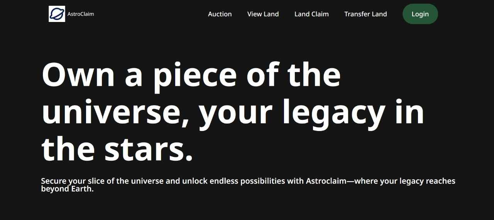
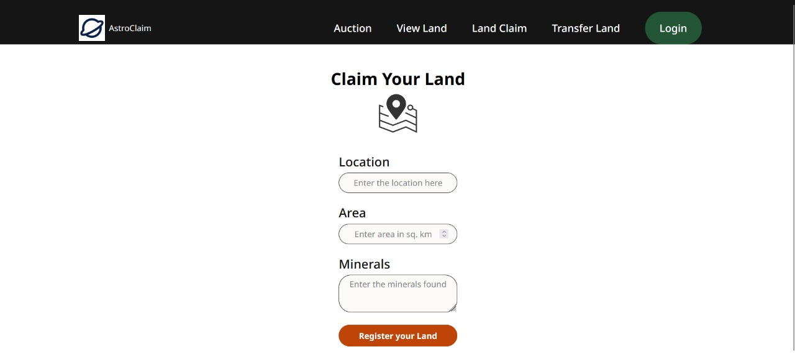
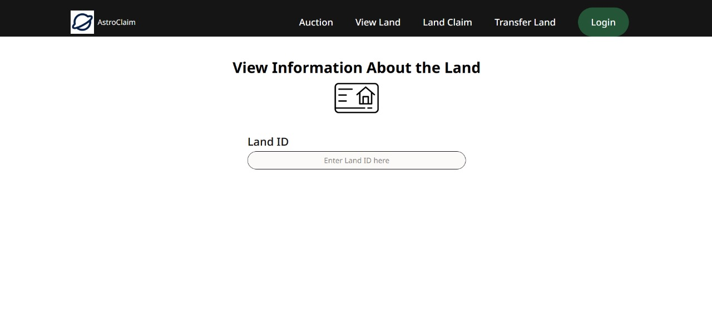
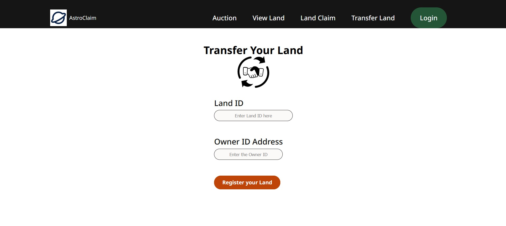

## Introduction

The concept of private ownership in outer space is evolving as space exploration and commercial activities expand. With advancements in technology, private entities are increasingly interested in claiming and managing extraterrestrial resources.

## Objectice

Our project proposes a system where individuals and private organizations can claim extraterrestrial land, sell the land and manage transaction of resources through auctions

## Technologies Used:

### Block Chain : 

  We have used block chain technology to make the system decentralised and process the transaction efficiently.

## Some features of our website

## 1. Home Page

## 2. Claim Your Land

## 3. View your land status

## 4. Transfer your land 

